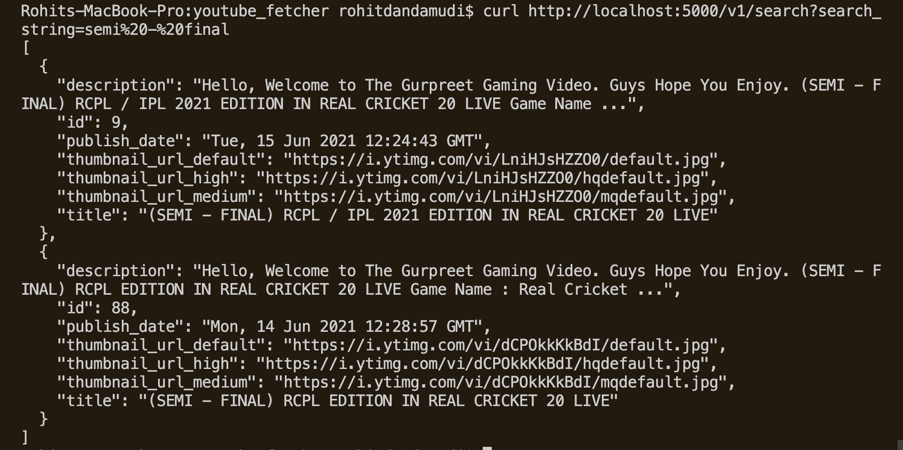

# youtube_fetcher

an API to fetch latest videos sorted in reverse chronological order of their publishing date-time from YouTube for a given tag/search query in a paginated response.

## Installation Steps

- Create a virtual environment ```python3 -m venv venv```
- Install required dependencies using ```pip3 install -r requirements.txt```
- To run the API, use ```flask run```
- Update ```YOUTUBE_DATA_API_KEY``` at ```app/config``` to run background process
- To run the background process of storing latest youtube video details, open other terminal and run ```hypercorn background_process:asgi_app```
- **NOTE:** Specify your own API key if limit reaches


## Docker 
If using docker, follow the steps below
- To build, ```docker build -t youtube-fetcher .```

- To run, ```docker run -p 5000:5000 -p 8000:8000 youtube-fetcher```

## Checking application 


The API comes with two endpoints:

- ```/v1/fetch_stored_youtube_videos``` to get which returns the stored video data in a paginated response sorted in descending order of published datetime.
    - Test using, by default gives 5 response
    ``` 
    curl http://localhost:5000/v1/fetch_stored_youtube_videos?start=4

    ```
    - Output: 
- ```/v1/search``` To search matching the youtube videos data in the database
    - Test using 
    ``` 
    curl http://localhost:5000/v1/search?search_string=semi%20-%20final

    ```
    - Output: 